# DITA-ditaot-utilities

This is a collection of utilities intended to make it easier to work with the DITA Open Toolkit.

Although to be honest, there's only a single utility:

* `install_ditaot.sh` - install (or reinstall) the latest version of the DITA Open Toolkit

## Getting Started

You can run these utilities on a native linux machine, or on a Windows 10 machine that has Windows Subsystem for Linux (WSL) installed.

### Installing

Download or clone the repository, then put its `bin/` directory in your search path.

For example, in the default bash shell, add this line to your `~/.profile` file:

```
PATH=~/DITA-ditaot-utilities/bin:$PATH
```

## Usage

### install_ditaot.sh

This is a bash script that checks the DITA-OT website for the latest version, then installs it:



If the latest version is already installed, the script asks if it should be reinstalled:


This reinstallation can be useful if you've modified the DITA-OT to run experiments.

The script installs the DITA-OT in your home directory in a directory named after its version:

`~/dita-ot-<VERSION>`

In addition, a version-independent filesystem link is created at

`~/dita-ot`

so that you can put `~/dita-ot` in your `$PATH` and always get the latest version.

## Author

My name is Chris Papademetrious. I'm a technical writer with [Synopsys Inc.](https://www.synopsys.com/), a semiconductor design and verification software company.
