# DITA-ditaot-utilities

This is a collection of utilities intended to make it easier to work with the [DITA Open Toolkit](https://www.dita-ot.org/).

* `ditaot_install.sh` - install (or reinstall) the latest version of the DITA Open Toolkit
* `ditaot_validate.pl` - validate DITA map/topic files (RelaxNG schemas only)
* `ditaot_save_preprocessing.pl` - save the results of each stage of `preprocess` or `preprocess2`

All scripts begin with `ditaot_` so you can use shell autocompletion if you don't remember the exact name of a script in this collection.

## Getting Started

You can run these utilities on a native linux machine, or on a Windows 10 machine that has Windows Subsystem for Linux (WSL) installed.

### Prerequisites for ditaot_install.sh

The `ditaot_install.sh` script is a simple Bash script that does not have any prerequisites.

### Prerequisites for ditaot_validate.pl

Before using the `ditaot_validate.pl` script, you must have the `jing` RelaxNG validation command installed:

```
sudo apt update
sudo apt install jing
```

In addition, the version should be 20181222 or later (earlier versions tend to crash when validating against DITA schemas):

```
$ jing
Jing version 20181222
usage: java com.thaiopensource.relaxng.util.Driver [-i] [-c] [-s] [-t] [-C catalogFile] [-e encoding] RNGFile XMLFile...
RELAX NG is a schema language for XML
See http://relaxng.org/ for more information.
```

### Prerequisites for ditaot_save_preprocessing.pl

Before using the `ditaot_save_preprocessing.pl` script, you must install the following perl modules:

```
sudo apt update
sudo apt install cpanminus
sudo cpanm install URI::Encode XML::Twig utf8::all
```

### Installing

Download or clone the repository, then put its `bin/` directory in your search path.

For example, in the default Bash shell, add this line to your `~/.profile` file:

```
PATH=~/DITA-ditaot-utilities/bin:$PATH
```

## Using ditaot_install.sh

This is a Bash script that checks the DITA-OT website for the latest version, then installs it:



If the latest version is already installed, the script asks if it should be reinstalled:


This reinstallation can be useful if you've modified the DITA-OT to run experiments.

The script installs the DITA-OT in your home directory in a directory named after its version:

`~/dita-ot-<VERSION>`

In addition, a version-independent filesystem link is created at

`~/dita-ot`

so that you can put `~/dita-ot` in your `$PATH` and always get the latest version.

### Automatically Installing Plugins

If you have DITA-OT plugins to be installed, add the following to your `~/.profile` file to specify the list of plugins to install (exact syntax is important so that the entries are linefeed-separated-only, with no indenting):

```
# DITA-OT plugins for the ditaot_install.sh script to install
export DITAOT_PLUGINS_TO_INSTALL="\
/path/to/com.my.plugin1
/path/to/com.my.plugin2
/path/to/com.my.plugin3"
```

When this variable is defined, the script creates filesystem links to them in the `~/dita-ot-<VERSION>/plugins` directory, then runs `dita install` to install them.

## Using ditaot_validate.pl

This is a Perl script that validates DITA map and topic files. Because it uses `jing` to perform validation (and validation only), it is much faster than performing validation by transforming files with the `dita` command.

The usage is as follows:

```
$ bin/ditaot_validate.pl -help
Usage:
    ditaot_validate.pl [options] path [path ...]

      path [path ...]
          Files or directories to validate
          (files must use RelaxNG schema via <?xml-model ...?>)
          (for directories, all .ditamap and .dita files are validated)
      [--dita /path/to/bin/dita]
          Specifies which DITA-OT installation to use for DITA grammars
          (default is from 'dita' in search path)
      [--verbose]
          Print additional information about files and schemas

    For example, to validate all .dita/.ditamap files in 'my_dir/',

      ditaot_validate.pl my_dir
```

When directories are specified, all `.ditamap` and `.dita` files in the specified directories are validated.

For example,



The files must use a RelaxNG schema, declared using `<?xml-model ...?>` at the top of the file. For example,

```
<?xml version="1.0" encoding="UTF-8"?>
<?xml-model href="urn:oasis:names:tc:dita:rng:topic.rng" schematypens="http://relaxng.org/ns/structure/1.0"?>
<topic id="topic">
    <title>My Topic</title>
    <body>
        <p>This is my topic.</p>
    </body>
</topic>
```

**Note:** Currently, `jing` crashes when validating DITA grammars that include the `svg-d` domain. I am not sure how to resolve this yet.

By default, the DITA grammars are obtained from the DITA-OT installation determined from `dita` in your search path, but you can use `--dita` to specify a particular installation. You can specify the path to the DITA-OT root directory or the `dita` script. The DITA-OT installation only provides the grammar schemas; it is not used to perform the validation.

## Using ditaot_save_preprocessing.pl

This is a Perl script that adds instrumentation to your DITA-OT installation to save the results of each stage of `preprocess` or `preprocess2`.

The usage is as follows:

```
$ ditaot_save_preprocessing.pl --help
Usage:
      [--pipeline preprocess | preprocess2]
           Specifies which preprocessing pipeline to modify (default is 'preprocess')
      [--add]
           Add preprocess copy operations to the build_<pipeline>.xml file
      [--remove]
           Remove preprocess copy operations from the build_<pipeline>.xml file
      [--dita /path/to/bin/dita]
           Specifies which DITA-OT installation to use (default is from 'dita' in search path)
```

To add the instrumentation, use the `--add` option:


By default, the DITA-OT installation is determined from `dita` in your search path, but you can use `--dita` to specify a particular installation. You can specify the path to the DITA-OT root directory or the `dita` script.

By default, the `preprocess` pipeline is instrumented. To instrument the `preprocess2` pipeline instead, use the `--pipeline preprocess2` option.

The results of each preprocessing stage are saved to the same location as the regular DITA-OT temporary directory, but with a suffix that includes the stage name and its numeric index in the preprocessing sequence. The instrumentation always saves results, regardless of the value of the `clean.temp` parameter. The transformation prints messages to indicate where the results are saved. For example,


The numeric index allows you to use shell autocompletion to use the `diff -r` command to compare an earlier stage against subsequent stages to see when something happens. For example,

```
cd /tmp
diff -r my_tmp_dir-4-debug-filter my_tmp_dir-5-<TAB>
diff -r my_tmp_dir-4-debug-filter my_tmp_dir-6-<TAB>
diff -r my_tmp_dir-4-debug-filter my_tmp_dir-7-<TAB>
...
```

**Only files matching `*.dita*` are saved**. They are run through an XSLT transformation (defined within the `ditaot_save_preprocessing.pl` script itself) to remove superfluous attributes that can add clutter and complicate diffs. Feel free to modify the XSLT transformation as needed to suit your needs.

To remove the instrumentation from your DITA-OT, use the `--remove` option:


(And don't forget to delete the extra saved directories when you no longer need them - they add up quickly!)

## Author

My name is Chris Papademetrious. I'm a technical writer with [Synopsys Inc.](https://www.synopsys.com/), a semiconductor design and verification software company.
